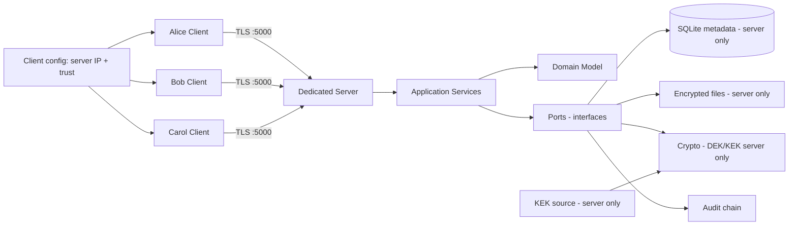
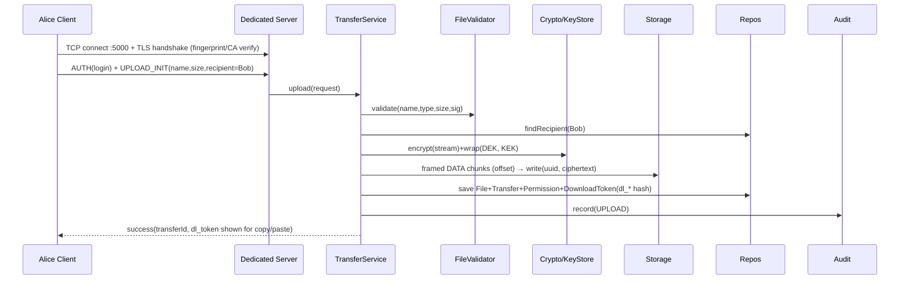

# Secure File Transfer System — MASTER Document

> **One file = whole project.** Technical accuracy + simple explanations side by side.
> **Stack:** C++20 · STL-only CLI + ANSI (Stage-0) → optional FTXUI in `presentation/` (Final) | Raw TCP + TLS 1.3 via Asio + OpenSSL on fixed port 5000, custom framing, behind `ITransport` | SQLite + binary storage | Argon2id + AES-256-GCM (per-file DEK + versioned KEK)
> **Course:** CI2013 OOP | **Trust model:** Trusted server (server CAN decrypt — NOT end-to-end) | **Topology:** Dedicated server laptop + 2-3 client laptops (Alice/Bob[/Carol]); server never on Alice/Bob laptop
> Related: `project_description.md` (spec) · `system_architecture.md` (design) · `research_report.md` (why)

---

## 0. TL;DR

**In simple words:** Like a secure courier with a central office. Alice goes to the office (dedicated server laptop) over an armored tunnel and leaves a locked box for Bob only. Bob goes to the same office with ID proof (+ short-lived pickup slip) to collect it. Carol is turned away. Every pickup/attempt is written in a register nobody can secretly edit. If anyone tampers with the box, it won't open.

**Technically:** Dedicated server + N clients over raw TCP + TLS 1.3 (Asio + OpenSSL, port 5000, length-prefixed framing, `ITransport` abstraction). Authenticated sender→named-recipient transfer. Per-file random DEK wrapped by versioned KEK, AES-256-GCM, fresh 96-bit nonce, Argon2id passwords, default-deny authz (`owner ∨ active grant`), staged-write persistence, hash-chained audit, short-lived opaque download tokens (auth, NOT keys), expiring grants, resumable uploads.

**Viva promise:** *3-laptop Alice→Bob via dedicated server with per-file DEK, login+token authz, tamper-evident audit, resume-after-crash — all behind replaceable interfaces, proven by Carol-DENY + tamper + token-expire/revoke + kill-resume demos.*

---

## 1. Problem & Goals

### Problem
Shared folders / plain uploads give no identity, no encryption, no permission check, no history.

### What we build
| # | Capability | Simple meaning |
|---|---|---|
| 1 | Register / login / logout, admin activate-deactivate | ID card office |
| 2 | Upload file for a named recipient | Give locked box for Bob only |
| 3 | List sent / received, download if allowed, delete own | Inbox / outbox |
| 4 | Encryption + integrity + audit on every step | Lock + seal + register |
| 5 | Tests + demo prove OOP + security | Show marks evidence |

**Success =** login works, no plaintext/keys in storage or logs, tampered file never delivered, unauthorized denied + logged, crash leaves no orphans, fakes can replace real storage/crypto/transport (polymorphism), every syllabus outcome has code + test + demo.

**Non-goals (MVP):** token-only/public-link access (standard flow = login + token), E2E (server can't read), MFA, live antivirus, cloud/cluster, browser app, cpp-httplib status pages, internet-scale/public CA certs. TLS cert ≠ file-encryption key.

---

## 2. How It Works — Alice → Bob via Dedicated Server

> Deployment: 3 laptops min (Server laptop + Alice laptop + Bob laptop), optional 4th (Carol). Server laptop owns SQLite DB + `storage/encrypted/` + KEK + TLS key + audit. Clients hold only exe + config + server trust material. Alice/Bob never host the server. Isolated net: server laptop creates hotspot, clients join (no college WiFi / mDNS dependency).

```
1. Server laptop: start server on 0.0.0.0:5000, display IPv4 + cert fingerprint. Admin seeded separately.
2. Alice laptop: login → Yes/No: upload <file>? → Yes/No: send to Bob? → upload over TLS
3. Server: check login → check Bob exists → check file (name/type/size)
         → make random DEK → AES-GCM encrypt → wrap DEK with KEK
         → save ciphertext as UUID file → save metadata row → mint opaque download token dl_* (SHA256 stored) → audit UPLOAD
4. Bob laptop: login → list received → Yes/No: download? → download with login + token
5. Server: check Bob == recipient AND token valid (hash match ∧ ¬revoked ∧ now<expires ∧ uses<max ∧ bind==Bob)
         → load metadata → read ciphertext → unwrap DEK → verify GCM tag + digest
         → send plaintext over TLS → mark DOWNLOADED → audit DOWNLOAD
6. Carol laptop (optional 4th): tries Bob's file → DENY + audit DENIED. No bytes sent.
7. Tamper 1 byte: IntegrityException, no delivery, audit INTEGRITY_FAIL.
```

UI rule: simple Yes/No confirmations only (`Upload <name> for Bob? [y/N]`, `Download <name>? [y/N]`). All policy still enforced server-side.

---

## 3. Architecture — Layered + Ports

**Simple:** UI is thin counter. Domain = rules. Services = managers. Ports = sockets on wall. Adapters = real machines you plug in (or fake toy versions for tests).

```
SAME APPLICATION
       │
 ┌─────┴─────┐
 │           │
Stage-0 CLI Final UI
 │           │
STL + ANSI  FTXUI (presentation/ only)
 │           │
 └─────┬─────┘
       ▼
 Application (TransferService/AuthService/PolicyEngine)
       ▼
    Domain (pure, no UI/crypto/DB includes)
```

```
Alice-Client ─┐
Bob-Client ───┼── raw TCP + TLS 1.3 :5000 (framed) ──→ Dedicated Server → ServerRequestHandler → TransferService / AuthService
Carol-Client ─┘                                              (owns DB + encrypted store + KEK + TLS key + audit)
               → Domain (User, FileRecord, Transfer, Permission, Grant, DownloadToken, AuditEvent)
               → Ports (IStorage, IEncryptionProvider, IPasswordHasher, IAuditLogger, IAccessPolicy, IKeyStore, IChunkStore, IScannerAdapter, Repositories, ITransport)
               → Infrastructure (BinaryFileStorage, SqliteRepo, AesGcmProvider, Argon2Hasher, AsioTlsTransport, HashChainLogger)
```



### 3a. Deployment & network standard (2–4 laptops)

- Min: Server laptop + Alice laptop + Bob laptop; optional 4th Carol laptop for DENY demo. Alice/Bob never act as server; N clients connect concurrently to same server.
- Standard isolated net: server laptop hosts mobile hotspot, clients join. Display server IPv4 + port 5000 + cert fingerprint on server screen. Windows Firewall Allow for 5000. No college WiFi / AP-isolation / mDNS dependency. Fallback: wired switch or USB-tethered network.
- Single port 5000 throughout: Stage-0 plain framing (bring-up only), Stage-3+ TLS 1.3 mandatory. No port changes to avoid re-allowing firewall.

### 3b. UI philosophy (same application, swappable presentation)

- Stage-0: STL-only CLI with ANSI-enhanced presentation (colors, progress %/spinner, tables, success/error indicators). Zero third-party UI/web deps. Commands: `register/login/upload <file> --to Bob [--token-expiry]/list/download --token dl_.../revoke/verify`. Yes/No confirmations only.
- Final: optional FTXUI isolated entirely under `presentation/`; `domain/` + `application/` remain UI-independent (no FTXUI includes). Do NOT add cpp-httplib status pages.
- OOP value stays in domain/app; UI is replaceable adapter proving polymorphism.

### 3c. Transport — raw TCP + TLS 1.3 framing (Asio + OpenSSL)

- TCP is byte-stream: explicit framing ` [uint32 net-order len][msg bytes] ` where msg = `{type, requestId, payload}`. Types: `HELLO, AUTH, UPLOAD_INIT/DATA/COMMIT, DOWNLOAD_REQ/DATA, LIST, REVOKE, ERROR`. Max frame 1–4MB, chunked DATA with `offset`, server `seek`, resume via `offset`.
- Behind `ITransport` (`connect/send/recv/close`, `FakeTransport` for tests). App/domain never include Asio/OpenSSL headers.
- Rejected: HTTP/cpp-httplib (hides socket skill, extra HTTP surface), WebSocket (Upgrade issues), QUIC (UDP blocked, ~800 LOC). Raw TCP chosen for socket visibility + single-port firewall story.

### 3d. PKI — fingerprint (Stage-0) → Demo CA (Final)

- Stage-0: self-signed server cert, fingerprint (SHA-256) displayed on server + manually verified on clients, then pinned in client config for subsequent connects. No mandatory USB transfer.
- Final: project-local Demo CA signs server cert; clients trust Demo CA cert; validate chain + expiry + expected server identity (SAN/IP). No commercial/public CA. `testssl.sh` + expired/SAN-mismatch reject tests.
- Cert/CA = server identity + TLS only. File-at-rest = AES-256-GCM DEK + versioned KEK. Never use TLS cert as file-encryption key.

### Key classes

**Domain (pure C++, no library includes):**
`User` → `RegularUser`, `Administrator` | `FileRecord` (no plaintext path, only storageId) | `Transfer` (status machine: CREATED→UPLOADED→DOWNLOADED / FAILED) | `Permission` + `Grant{file, grantee, expiresAt, nonce, revoked}` + `DownloadToken{tokenHash, fileId, creator, expiresAt, maxUses, useCount, revoked, recipientBind}` — opaque auth, NOT key | `AuditEvent{seq, ts, actor, action, fileId, cipherHash, prevHash, msgHash}` | Value types `UserId, FileId, TransferId, Digest, WrappedKey{keyId, kekVersion, nonce, bytes, alg}` — private data, validating constructors, `==/</<<` only where readable.

**Application:** `AuthenticationService`, `TransferService`, `FileQueryService`, `AdministrationService`, `PolicyEngine: IAccessPolicy`, `UploadCoordinator`, `TransactionCoordinator`, `KeyRotationService`, `AuditVerifier`, `ErrorTranslator`.

**Ports (every port has Real + Fake):**
`IUserRepository, IFileRepository, ITransferRepository, IStorage, IEncryptionProvider, IPasswordHasher, IAuditLogger, IAccessPolicy, ITransport, IKeyStore, IChunkStore, IScannerAdapter`

**Infrastructure:** `BinaryFileStorage, SqliteMetadataRepository, AesGcmProvider (libsodium/OpenSSL), Argon2PasswordHasher, HashChainAuditLogger/DatabaseAuditLogger, AsioTlsTransport (Asio + OpenSSL, framed), ConfigurationProvider, Fake*` for tests. Clients never receive KEK, TLS private key, DB, or server store.

**OOP mapping:**

| Syllabus | Where |
|---|---|
| Encapsulation | Private entity state + validated methods |
| Inheritance | `User` base, `RegularUser/Administrator`; `AppException` tree |
| Polymorphism | `IStorage/ICrypto/IAudit/IPolicy/ITransport` real vs fake at runtime |
| Composition | `TransferService(storage+repo+validator+crypto+policy+audit)` |
| CTOR/DTOR + RAII | Invariant CTORs; guards close files/sockets/Tx/locks; `unique_ptr`, no owning raw `new` |
| Templates | `Repository<T>, Result<T>, PagedCollection<T>, filter<T>` |
| Operators | `==/</<<` for IDs only |
| Exceptions | `Validation, Auth, NotFound, Storage, Crypto/Integrity, Transport` → safe message at UI |
| Streams/files | Binary `ifstream/ofstream`, state checks, `filesystem::rename/lexically_normal` |

---

## 4. Security — Technical + Simple

> Rule: **use vetted libs, never invent crypto.** (OWASP, NIST)

| Topic | Technical | Simple | Must-do |
|---|---|---|---|
| **Passwords** | Argon2id, unique 128-bit salt, min m=19MiB t=2 p=1 (OWASP; RFC 9106 Sep 2021). Never SHA-256/plain. | Slow puzzle lock — thief can't guess fast. | Params in config; generic `Login failed`; per-account rate-limit + lockout (NIST 800-63B-4). |
| **File crypto** | AES-256-GCM, random DEK/file, 128-bit tag, fresh 96-bit nonce every encrypt (NIST SP 800-38D 2007-11-28: reuse breaks all). | New key + new seal per box. Reused seal = forgeable. | `randombytes_buf/RAND_bytes`; never 0/hardcode; `is_available()` check on libsodium. |
| **Key hierarchy** | DEK encrypts file, KEK wraps DEK (NIST SP 800-57 Pt.1 Rev.5 2020-05-04; 800-38F KW). KEK from env/protected file, versioned, never in git. | Box key in envelope locked by master key. Change master without re-locking all boxes. | `WrappedKey{kekVersion, alg=AES-256-KW/GCM}`; rotate→new primary, old decrypt-only, lazy re-wrap. |
| **Integrity** | GCM tag = proof; SHA-256(plaintext) = diagnostics only. Treat digest as sensitive (confirmation oracle). | Wax seal = proof; photocopy checklist = helper. Don't post checklist publicly. | Verify tag AND digest; no delivery on fail; never use digest as dedup key. |
| **Transport** | Raw TCP + TLS 1.3 (RFC 8446 Aug 2018) via Asio + OpenSSL, port 5000, length-prefixed framing, 1.2 compat, no 1.0/1.1 (RFC 8996), no 0-RTT, verify peer + identity. Stage-0: pinned self-signed fingerprint; Final: Demo CA chain. | Armored tunnel, check ID of other end. Fingerprint = photo ID check; Demo CA = office badge printer. | No `verify_none` in production path; `testssl.sh`; expired/SAN-mismatch must reject. |
| **Upload validation** | Allow-list + magic bytes (not MIME alone), size pre+post (zip-bomb), `lexically_normal + starts_with(root)`, UUID name, no exec bit, outside webroot (OWASP Upload). | Bouncer checks list + opens bag + checks size + gives token number. | Reject `../`, NUL, double-ext `.jpg.php`. |
| **AuthZ** | Default-deny: `owner ∨ active ∧ ¬revoked ∧ now<expiresAt` in one `isAuthorized()` (OWASP AuthZ). Check before touching disk. Download also requires valid opaque token (see below). | Default NO. Check guest list before opening vault. | Admin sees metadata, not content. |
| **Download tokens (auth, NOT keys)** | Opaque `dl_<32B CSPRNG base64url>`; store only `SHA256(token)`. Valid iff `hash match ∧ ¬revoked ∧ now<expiresAt ∧ uses<max ∧ bind==authUser`. Standard flow = login + token; token-only/public links out of scope. Copy/paste transfer, QR optional. | Pickup slip with expiry + name written on it — not a copy of the box key. | Never log/store raw token; revoke = flag; re-issue without re-encrypting file. |
| **Audit** | Append-only hash chain `msgHash=SHA256(canonicalJSON)`, `prevHash` link; UTC RFC3339; never passwords/keys/plaintext/paths (OWASP Logging; NIST SP 800-92 2006). Detects edit/delete/reorder, not fork-rewrite without TSA/WORM. | Register where each page number depends on previous — torn page is obvious. | `audit-verify` in CI; log `fileId,size,cipherHash,result` only. |
| **Errors/logs** | Typed exceptions → generic client string; detail only in protected server log. | Customer hears “denied”, manager sees full file. | Grep logs for secrets must be empty. |

### Chosen extensions (goal-gated, in this order)

1. **Expiring grants + download tokens:** `Grant` + `DownloadToken` + `PolicyEngine` + fake clock. Demo: 60s token/grant → expire → DENY; revoke → DENY.
2. **Hash-chained audit + verifier:** `HashChainAuditLogger` + `AuditVerifier verify --db`. Demo: `UPDATE audit…` → `FAIL@seq3`.
3. **Resumable upload:** `UploadSession{uploadId UUIDv4, totalSize/Chunks, wholeSHA256}` + per-chunk HMAC, offset assemble, whole-hash commit. Quota 100MB/user, chunk 1–4MB. Demo: kill at 50% → resume completes.

Hardening included: KEK rotation + crash-safe `write tmp→fsync→rename→fsync-dir→BEGIN IMMEDIATE→COMMIT` + `UNIQUE(upload_id)` + startup sweeper (SQLite `WAL + synchronous=FULL + foreign_keys=ON`, ≥3.51.3). Scanner = `IScannerAdapter` seam + fake only.

### Do NOT build now
E2E recipient keys (X25519 sealed-box — doubles scope, needs key directory + recovery; write `docs/future-e2e.md`), dedup/CAS (confirmation attack — Bellare DupLESS IACR 2013/429), token-only/public links, multi-sig, live ClamAV, MFA product, web GUI / cpp-httplib status pages, full Java/JDBC (only if graded), “secure delete” promises on SSD (NIST SP 800-88 Rev.1 2014-12-18 — only crypto-shredding = delete DEK is credible). TLS cert must never be used as file-encryption key.

---

## 5. Data & Files

**SQLite tables:**

```sql
users(id TEXT PK, username UNIQUE, email UNIQUE, pass_hash TEXT, role TEXT, status TEXT, failed_attempts INT);
files(id TEXT PK, owner_id TEXT, orig_name TEXT, storage_id TEXT UNIQUE, size INT, mime TEXT, digest TEXT, wrapped_dek BLOB, kek_version INT, nonce BLOB, upload_id TEXT UNIQUE, created_at TEXT);
transfers(id TEXT PK, file_id TEXT, sender TEXT, recipient TEXT, status TEXT, created_at TEXT, updated_at TEXT);
permissions(file_id TEXT, user_id TEXT, type TEXT, expires_at TEXT, revoked INT, nonce TEXT, PRIMARY KEY(file_id,user_id));
download_tokens(token_hash TEXT PK, file_id TEXT, creator TEXT, recipient_bind TEXT, expires_at TEXT, max_uses INT, use_count INT, revoked INT);
audit_events(seq INTEGER PK, ts TEXT, actor TEXT, action TEXT, file_id TEXT, cipher_hash TEXT, prev_hash TEXT, msg_hash TEXT);
upload_sessions(upload_id TEXT PK, owner TEXT, total_size INT, total_chunks INT, whole_hash TEXT, status TEXT);
```

**Files (server laptop only):** `storage/encrypted/<uuid>.bin` + `*.part` temps only. Original name = display metadata. `exportBundle(manifest.json + blobs + dump)` / `importBundle(verify→Tx insert)` for tests. Clients store only exe + `client.ini` (server IP:5000 + pinned fingerprint / Demo CA cert), never DB/KEK/TLS key.

---

## 6. Folder Structure

```
secure-file-transfer/
├── CMakeLists.txt
├── include/domain/ application/ ports/ infrastructure/
├── src/domain/ application/ infrastructure/ presentation/  # presentation/ = STL+ANSI now, FTXUI later; domain/app never include UI headers
├── client/ server/  # separate exes; server owns DB/store/KEK/TLS key
├── storage/encrypted/  # server laptop only
├── database/schema.sql
├── certs/  # demo-ca/ (Final) + server fingerprint pin (Stage-0)
├── tests/domain/ application/ security/ integration/
├── docs/project_description.md system_architecture.md future-e2e.md
├── config.example.ini  # server IP:5000 + trust (fingerprint/CA) + storage/DB/Argon2/KEK path placeholder
└── README.md
```

`config.example.ini` holds server address, trust material reference, storage path, DB path, Argon2 params, KEK path placeholder — never real secrets. Client `client.ini` holds only server IP:5000 + fingerprint/CA + username context.

---

## 7. Upload / Download Sequences



Download: `AUTH(Bob) + DOWNLOAD_REQ(fileId, dl_token)` over same TLS framing → `isAuthorized()==owner/recipient ∧ tokenValid(hash∧¬revoked∧now<exp∧uses<max∧bind==Bob)` → deny? `audit DENIED` : load meta → read cipher → `decryptAndVerify` → fail? `IntegrityException + audit` : framed DATA deliver over TLS → mark downloaded → audit.

Crash-safe write: `tmp.<uuid>.part → flush → fsync → rename (same FS) → fsync-dir → BEGIN IMMEDIATE → INSERT → COMMIT`; fail → `remove()`; boot → sweeper deletes unreferenced temps.

---

## 8. Demo Script (3–4 laptops, hotspot, :5000)

Setup: server laptop hotspots, prints `IPv4:5000 + fingerprint`; clients enter IP, verify fingerprint shown matches (Stage-0) / Demo CA validates (Final). All prompts Yes/No only.

1. Server start; Alice/Bob register (Carol optional 4th); show salted hash, no plaintext.
2. Alice: `Upload assignment.pdf for Bob? [y/N] y` → upload framed over TLS → server shows UUID file, `nonce/wrappedDEK(v1)/cipherHash`, `hexdump` differs, audit OK. `dl_*` shown for copy/paste.
3. Bob: `Download assignment.pdf? [y/N] y` with login + token → `sha256sum` matches, status DOWNLOADED.
4. Carol (wrong bind or no token): DENY + audited; admin can't `cat` content (sees metadata only).
5. Flip 1 byte → `IntegrityException`, no file, `INTEGRITY_FAIL`. `UPDATE audit…` → `audit-verify FAIL@3`.
6. Token 60s → expire → DENY; re-issue → revoke → DENY (Stage-4).
7. Restart `--storage=memory --crypto=fake --transport=fake` → same flow (polymorphism incl. ITransport).
8. 20MB upload, kill at 50%, `resume --upload-id` completes; tampered chunk aborts.
9. `rotate-kek` → v2; old file opens, new file v2.
10. Templated query `sender=Alice & DOWNLOADED`; kill-test leaves no `*.part`. `reset-demo` fallback + wired/tether backup ready.

---

## 9. Tests — GREEN gates (no stage compensates for earlier failure)

Domain invariants · Argon2id + lockout (no enumeration) · traversal/double-ext/MIME-spoof/oversize/zip-bomb + fuzz · authZ matrix (owner/recipient/stranger/wrong-bind/revoked/expired/token-reuse/admin) + mutation kill · token rules (hash-only store, expiry, max_uses, bind, revoke/re-issue) · crypto round-trip + 10k nonce uniqueness + tag/wrong-key fail + no partial output · framing (split/coalesced/duplicated/out-of-order chunks → same bytes or abort) · kill-9 + sweeper + idempotent retry (zero orphans) · chain genesis→N, mutate/delete/reorder detect, injection encoded, no secrets · chunks shuffled/duplicated/missing → same bytes or abort · TLS: fingerprint mismatch reject (Stage-0), expired/SAN-mismatch/CA-mismatch reject (Final), no `verify_none` in prod path, 0-RTT off · fake-vs-real parity incl. `FakeTransport` · E2E register→verify over TLS. Coverage ≥80% domain/app, 100% `isAuthorized/tokenValid/verifyChain/wrap-unwrap/framing`.

---

## 10. Roadmap — goal-gated (pace-independent, no compensating later for earlier failure)

> Dates are estimates only. A stage is GREEN only when its exit tests (§9 slice) pass.

- **Stage 0 DEMO / MVP — Alice→Bob across 3 laptops:** STL+ANSI CLI, hotspot :5000, fingerprint pin, Yes/No flow, Alice→Bob OK + Carol DENY + 1-byte INTEGRITY_FAIL. GREEN = multi-machine flow proven.
- **Stage 1 LOCAL:** IDs, entities, `Grant/DownloadToken/AuditEvent/WrappedKey`, exceptions, `Repository<T>/Result<T>`, Auth + Transfer + Policy + Validator + fakes (`FakeTransport` incl.). GREEN = offline flow + matrix green.
- **Stage 2 PERSIST + CRYPTO:** AES-GCM, binary store (server-only), SQLite WAL, Tx+sweeper+idempotency, KEK versioning/rotation. GREEN = kill-9 no orphans + rotation v1→v2 green.
- **Stage 3 NETWORK:** Asio + OpenSSL framing + `ITransport`, sessions, TLS verify (fingerprint → Demo CA), `ErrorTranslator`, E2E-over-TLS. GREEN = TLS reject tests + E2E green. **→ SCOPE FREEZE here.**
- **Stage 4 EXTENSIONS (only 3 pre-approved):** grants + tokens (60s expire + revoke) → chain + `audit-verify` → resume (kill at 50% → resume). Cut per-chunk HMAC→whole-hash if slipping, never add new scope.
- **Evidence (continuous):** diagrams, CO map, STRIDE, test report, limits + `future-e2e.md`, scripted hotspot demo.
- Team of 3: A domain+policy+audit+tokens · B crypto+storage+Tx+KEK · C transport+client/CLI+PKI/tests/docs.

```
Stage 0 DEMO → GREEN → Stage 1 LOCAL → GREEN → Stage 2 PERSIST+CRYPTO → GREEN → Stage 3 NETWORK → GREEN → SCOPE FREEZE → Stage 4 EXTENSIONS
```

---

## 11. Threats (STRIDE, 1-line each)

Spoof→Argon2id+TLS(fingerprint/Demo CA)+login+token bind+lockout · Tamper→GCM+chain+manifest-HMAC+framing checks · Repudiate→chained audit (weak w/o sig/TSA — documented) · Disclose→dedicated server owns DB/KEK/TLS key, default-deny+no-secret logs, clients hold only trust material (server can read — accepted, TLS cert ≠ DEK) · DoS→quota/chunk-cap/frame-cap/timeout · EoP→central authorizer + tests. Boundaries: client↔dedicated-server, server↔disk/DB, server↔KEK config, server↔Demo CA, admin meta vs content. Time from server clock (monotonic enforce + UTC record). MITM via rogue server → blocked by fingerprint/CA + token bind.

---

## 12. Tradeoffs (why not X)

C++20 over Java: RAII/streams/templates visible, more ownership care. STL+ANSI CLI over FTXUI now: zero-dep reliability, same app seam for later TUI. Raw TCP+TLS (Asio/OpenSSL) over HTTP: socket skill visible, single-port firewall story, framing behind ITransport; HTTP rejected (hides transport), WebSocket/QUIC rejected (Upgrade/UDP issues). Console over web: no XSS/CSRF, reliable demo. AES-GCM: one primitive, nonce discipline required. Argon2id: slow-by-design. DEK+KEK: blast-radius small, more metadata. Opaque token over passphrase-as-key: revocable, re-issuable, no recovery catastrophe. Trusted-server over E2E: feasible, honest limit (E2E → future-e2e.md). Fingerprint→Demo CA over public CA: realistic PKI without external dep. Dedicated server over peer-hosting: concurrent clients, no dependence on Alice/Bob laptop up. SQLite over MySQL: zero-ops grading, same port. FS blobs over DB blobs: streaming, needs sweeper. ACL+grants+tokens: least-privilege window, clock needed. Chain over plain log: tamper-evident, growth + clock. Resume: reliability for state-machine cost. No dedup: avoids oracle. Seam-only scan: no false safety.

---

## 13. Learn Before Coding (in order)

1. OOP + ownership: class/inherit/compose/virtual, `unique_ptr`, RAII, rule-of-5/0 — cppreference, Oracle OOP.
2. Exceptions + RAII cleanup — no `*.part` on throw.
3. Streams + `filesystem` — binary, `rename/lexically_normal`.
4. SQL + Tx — FK, `BEGIN IMMEDIATE`, WAL, prepared, `UNIQUE(upload_id)` — sqlite.org, MySQL docs.
5. Crypto use-not-invent — AEAD/nonce/tag, DEK/KEK, salt/pepper, CSPRNG, cert check — NIST 800-38D, 800-57/1R5, RFC 9106, OWASP, libsodium/OpenSSL docs. Must explain IV-reuse forgery + why SHA-256≠password hash.
6. Auth + TLS — default-deny, lockout, sessions, TLS 1.3 concepts — OWASP, RFC 8446, NIST 800-63B-4.
7. STRIDE + safe logging — Microsoft TM, OWASP Logging, NIST 800-92.
8. Tests — GTest, fakes, property/fuzz/mutation, `testssl.sh`.
9. Tools — CMake, SQLite/OpenSSL CLI.

---

## 14. Glossary (jargon → plain)

- **DEK/KEK:** box key / master key. **Nonce:** one-time seal number — never reuse. **GCM tag:** wax seal proving no tamper. **Argon2id:** slow puzzle for passwords. **TLS:** armored tunnel. **Fingerprint pin:** photo-ID check of server (Stage-0). **Demo CA:** office badge printer you run yourself (Final). **Download token dl_*:** pickup slip with name+expiry — auth, not key. **Grant:** guest pass with expiry. **Framing:** envelope sizes for TCP stream so messages don't merge/split. **Hash chain:** register where each page locks previous. **WAL:** notebook before ledger (SQLite). **Sweeper:** cleaner for crash leftovers. **Idempotency key:** “same order, don’t double-charge.” **RAII:** guard that always closes doors. **Port/Fake:** wall socket / toy plug for tests (incl. FakeTransport). **Dedicated server:** central office laptop; Alice/Bob are clients only.

## 15. Sources (primary only, accessed 2026-09-13)

NIST SP 800-57/1R5 (2020-05-04), 800-38D (2007-11-28) + 800-38F, 800-63B-4, 800-92 (2006-09-13), 800-88R1 (2014-12-18); OWASP Upload/Password/Crypto/AuthZ/Auth/Logging/TLS; RFC 8446 (2018-08), 8996, 9106 (2021-09), 9562 (2024-05), 3161 (2001-08), 6962 (2013-06→9162); JDK21 `Cipher`; libsodium (`aead_aes256gcm`, `pwhash`, `box_seal`), OpenSSL (`EVP_aes_256_gcm`, `RAND_bytes`, `EVP_KDF-ARGON2`), Botan; cppreference; sqlite.org (WAL/atomiccommit/FK); MySQL ACID/Connector; MS STRIDE (2022-08-25); Cornell CS5430 + Miller Caps; Bellare DupLESS IACR 2013/429; Wei FAST’11; Google Envelope docs.
