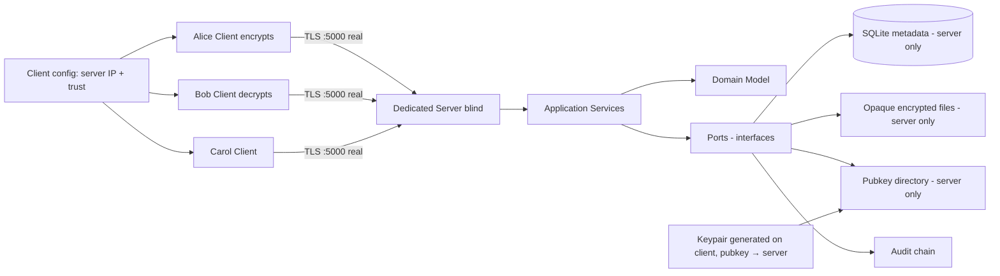
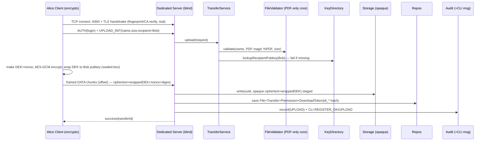

# Secure File Transfer System — MASTER Document

> **One file = whole project.** Technical accuracy + simple explanations side by side.
> **Stack:** C++20 · STL-only CLI + ANSI (Stage-0) → optional FTXUI in `presentation/` (Final) | Raw TCP + TLS 1.3 via Asio + OpenSSL on fixed port 5000, custom framing, behind `ITransport` | SQLite + binary storage | Argon2id + AES-256-GCM (per-file DEK wrapped to recipient pubkey via X25519/libsodium sealed-box)
> **Course:** CI2013 OOP | **Trust model:** End-to-end — Alice encrypts, Bob decrypts; server holds pubkey directory + ciphertext + TLS key + audit but NEVER plaintext, DEK, or recipient private key | **Topology:** Dedicated server laptop + 2-3 client laptops (Alice/Bob[/Carol]); server never on Alice/Bob laptop
> Related: `project_description.md` (spec) · `system_architecture.md` (design) · `research_report.md` (why)

---

## 0. TL;DR

**In simple words:** Like a secure courier with a central office that cannot open boxes. Alice locks a box with Bob's personal padlock (Bob's pubkey) at her laptop, then carries it to the office over an armored tunnel. The office stores the locked box without ever opening it. Bob goes to the same office with ID proof to collect it and unlocks it with his private key at his laptop. Carol is turned away. Every pickup/attempt is written in a register nobody can secretly edit. If anyone tampers with the box, it won't open.

**Technically:** Dedicated server + N clients over raw TCP + TLS 1.3 (Asio + OpenSSL, port 5000, length-prefixed framing, `ITransport` abstraction). Authenticated sender→named-recipient transfer with **end-to-end file crypto**: per-file random DEK, AES-256-GCM + fresh 96-bit nonce on **Alice's laptop**, DEK wrapped to **Bob's pubkey** (server pubkey directory, `libsodium crypto_box_seal` / X25519+AEAD, never private key on server). Encrypted transport (TLS) + encrypted at-rest (opaque ciphertext on server). Argon2id passwords, default-deny authz (`owner ∨ active grant`), staged-write persistence, hash-chained audit, short-lived opaque download tokens (auth, NOT keys), PDF-only in core then stretched.

**Viva promise:** *3-laptop Alice-encrypts→Bob-decrypts via dedicated blind server with per-file DEK wrapped to pubkey, login+token authz, tamper-evident audit — all behind replaceable interfaces, proven by real-TLS demo (no FakeTransport in live path), Carol-DENY + tamper + token-expire/revoke + kill-resume demos.*

---

## 1. Problem & Goals

### Problem
Shared folders / plain uploads give no identity, no encryption, no permission check, no history.

### What we build
| # | Capability | Simple meaning |
|---|---|---|
| 1 | Register / login / logout, admin activate-deactivate | ID card office |
| 2 | Upload file for a named recipient (PDF in core) | Give locked box for Bob only |
| 3 | List sent / received, download if allowed, delete own | Inbox / outbox |
| 4 | E2E encryption + TLS + audit on every step | Lock at Alice + armored tunnel + register |
| 5 | Tests + demo prove OOP + security | Show marks evidence |

**Success =** login works, no plaintext/keys/privkeys in storage or logs (server cannot decrypt), tampered file never delivered, unauthorized denied + logged, crash leaves no orphans, fakes can replace real storage/crypto/transport in **unit tests only** (polymorphism) — live gates use real TLS — every syllabus outcome has code + test + demo.

**Non-goals (MVP):** token-only/public-link access (standard flow = login + token), MFA, live antivirus, cloud/cluster, browser app, cpp-httplib status pages, internet-scale/public CA certs. TLS cert ≠ file-encryption key. Multi-file / multi-format / resume are **stretch after core single-PDF Alice→Bob is GREEN**.

---

## 2. How It Works — Alice → Bob via Dedicated Server (E2E)

> Deployment: 3 laptops min (Server laptop + Alice laptop + Bob laptop), optional 4th (Carol). Server laptop owns SQLite DB + `storage/encrypted/` (opaque ciphertext) + recipient pubkey directory + TLS key + audit. Clients hold only exe + config + server trust material + own keypair. Alice/Bob never host the server. Isolated net: server laptop creates hotspot, clients join (no college WiFi / mDNS dependency). All live demos use **real** `AsioTlsTransport` over TLS 1.3 — `FakeTransport` only for unit tests (see §3c).

```
1. Server laptop: start server on 0.0.0.0:5000, display IPv4 + cert fingerprint. Admin seeded interactively; users generate keypairs on first register.
2. Alice laptop: register (generates X25519 keypair, pubkey sent to server directory) → login → Yes/No: upload <pdf>? → Yes/No: send to Bob? → client-side: make random DEK → AES-GCM encrypt PDF with fresh 96-bit nonce → wrap DEK to Bob's pubkey (sealed-box) → upload ciphertext+wrappedDEK+nonce over TLS
3. Server: check login (sess_ + Argon2id + lockout) → check Bob exists + pubkey exists → check file (PDF magic + size)
         → save opaque ciphertext as UUID file → save metadata row (no DEK plaintext, wrappedDEK only) → mint opaque download token dl_* (SHA256 stored) → audit UPLOAD + small CLI msg REGISTER_OK/LOGIN_OK
4. Bob laptop: login → list received → Yes/No: download? → download with login + token (or login alone if token stretch not yet)
5. Server: check Bob == recipient AND isAuthorized(owner ∨ active ∧ ¬revoked ∧ now<expires) before touching disk AND token valid if present
         → load metadata → read opaque ciphertext+wrappedDEK → relay over TLS (server never decrypts) → mark DOWNLOADED → audit DOWNLOAD (+ CLI msg DOWNLOAD bob)
6. Bob client: unwrap DEK with private key → verify GCM tag + SHA-256(plaintext) digest → deliver PDF locally
7. Carol laptop (optional 4th): tries Bob's file → DENY + audit DENIED + CLI DENIED carol. No bytes sent.
8. Tamper 1 byte: IntegrityException on Bob, no delivery, audit INTEGRITY_FAIL.
```

UI rule: simple Yes/No confirmations only (`Upload <name> for Bob? [y/N]`, `Download <name>? [y/N]`). All policy still enforced server-side. Server CLI shows small audit msgs (`REGISTER_OK alice`, `LOGIN_OK bob`, `LOGOUT bob`, `DEACTIVATE alice`, `DENIED carol`, `TLS_FAIL`).

---

## 3. Architecture — Layered + Ports

**Simple:** UI is thin counter. Domain = rules. Services = managers. Ports = sockets on wall. Adapters = real machines you plug in (or fake toy versions for **unit tests only**).

```
SAME APPLICATION
       │
 ┌─────┴─────┐
 │           │
Stage-0 CLI Final UI
 │           │
STL + ANSI  FTXUI (presentation/ only)
 │           │
 └─────┬─────┘
       ▼
 Application (TransferService/AuthService/PolicyEngine)
       ▼
    Domain (pure, no UI/crypto/DB includes)
```

```
Alice-Client (encrypts, holds privkey) ─┐
Bob-Client (decrypts, holds privkey) ───┼── raw TCP + TLS 1.3 :5000 (framed, real) ──→ Dedicated Server → ServerRequestHandler → TransferService / AuthService
Carol-Client ─┘                                              (owns DB + opaque store + pubkey dir + TLS key + audit, CANNOT decrypt)
               → Domain (User, FileRecord, Transfer, Permission, Grant, DownloadToken, AuditEvent, KeyPair)
               → Ports (IStorage, IEncryptionProvider, IPasswordHasher, IAuditLogger, IAccessPolicy, IKeyDirectory, IChunkStore, IScannerAdapter, Repositories, ITransport)
               → Infrastructure (BinaryFileStorage, SqliteRepo, ClientAesGcmProvider + SealedBox, Argon2Hasher, AsioTlsTransport, HashChainLogger)
```



### 3a. Deployment & network standard (2–4 laptops)

- Min: Server laptop + Alice laptop + Bob laptop; optional 4th Carol laptop for DENY demo. Alice/Bob never act as server; N clients connect concurrently to same server.
- Standard isolated net: server laptop hosts mobile hotspot, clients join. Display server IPv4 + port 5000 + cert fingerprint on server screen. Windows Firewall Allow for 5000. No college WiFi / AP-isolation / mDNS dependency. Fallback: wired switch or USB-tethered network.
- Single port 5000 throughout. All live demos and Stage Gates use **real** `AsioTlsTransport`/`AsioTlsListener` TLS 1.3 — `FakeTransport`/`FakeListener` are permitted **only** in `tests/` unit tests to prove polymorphism (e.g., `Policy.*`, `Fakes.*`). `ctest` Stage Gates must use ephemeral real TLS (`listen(0)`).
- Core file type: **PDF only** until Stretch. `FileValidator` rejects non-PDF (allow-list + magic `%PDF` + size pre+post) — stretch adds PNG/JPG/ZIP/DOCX.

### 3b. UI philosophy (same application, swappable presentation)

- Stage-1..3: STL-only CLI with ANSI-enhanced presentation (colors, progress %/spinner, tables, success/error indicators). Zero third-party UI/web deps. Commands: `register/login/upload <pdf> --to Bob [--token-expiry]/list/download --token dl_.../revoke/verify`. Yes/No confirmations only. Server CLI prints small audit msgs for every auth/transfer event (see §2).
- Final: optional FTXUI isolated entirely under `presentation/`; `domain/` + `application/` remain UI-independent (no FTXUI includes). Do NOT add cpp-httplib status pages.
- OOP value stays in domain/app; UI is replaceable adapter proving polymorphism.

### 3c. Transport — raw TCP + TLS 1.3 framing (Asio + OpenSSL)

- TCP is byte-stream: explicit framing ` [uint32 net-order len][msg bytes] ` where msg = `{type, requestId, payload}`. Types: `HELLO, AUTH, UPLOAD_INIT/DATA/COMMIT, DOWNLOAD_REQ/DATA, LIST, REVOKE, ERROR`. Max frame 1–4MB, chunked DATA with `offset`, server `seek`, resume via `offset` (resume is stretch — chunk framing exists from core).
- Behind `ITransport` (`connect/send/recv/close`, `FakeTransport` for **unit tests only**). App/domain never include Asio/OpenSSL headers. Live path must construct `TrustConfig{fingerprint,certPath,keyPath,caPath}` and call `AsioTlsTransport::connect` with `verify_peer` + DER `SHA256` fingerprint + expiry/chain check. No `verify_none` in production path.
- **Real-network rule:** Every Stage Gate (`Stage1Gate.*`, `Stage2Gate.*`, `Stage3Gate.*`) and every viva demo uses real `AsioTlsTransport`/`AsioTlsListener` over TLS (ephemeral `listen(0)` in tests, `5000` in manual demo). `FakeTransport` is assertion helper for domain/policy unit tests only — claiming GREEN with fake is invalid.
- Rejected: HTTP/cpp-httplib (hides socket skill, extra HTTP surface), WebSocket (Upgrade issues), QUIC (UDP blocked, ~800 LOC). Raw TCP chosen for socket visibility + single-port firewall story.

### 3d. PKI — fingerprint (core) → Demo CA (Final)

- Core (Stage 1): self-signed server cert, fingerprint (SHA-256 of DER via `i2d_X509` + `EVP_sha256`) displayed on server + manually verified on clients, then pinned in client `TrustConfig` for subsequent connects. No mandatory USB transfer.
- Final: project-local Demo CA signs server cert; clients trust Demo CA cert; validate chain + expiry + expected server identity (SAN/IP). No commercial/public CA. `testssl.sh` + expired/SAN-mismatch reject tests.
- Cert/CA = server identity + TLS only. File-at-rest = AES-256-GCM DEK wrapped to **recipient pubkey** (X25519). Never use TLS cert as file-encryption key. Recipient keypair = X25519 (libsodium `crypto_box`/`crypto_box_seal`), pubkey stored in server directory, private key never leaves client.

### Key classes

**Domain (pure C++, no library includes):**
`User` → `RegularUser`, `Administrator` | `FileRecord` (no plaintext path, only storageId) | `Transfer` (status machine: CREATED→UPLOADED→DOWNLOADED / FAILED) | `Permission` + `Grant{file, grantee, expiresAt, nonce, revoked}` + `DownloadToken{tokenHash, fileId, creator, expiresAt, maxUses, useCount, revoked, recipientBind}` — opaque auth, NOT key | `AuditEvent{seq, ts, actor, action, fileId, cipherHash, prevHash, msgHash}` | `KeyPair{pubkey, privkey (client-only)}` + `WrappedKey{recipientId, nonce, bytes, alg=X25519-AES-GCM-Seal}` — private data, validating constructors, `==/</<<` only where readable. Value types `UserId, FileId, TransferId, Digest, WrappedKey`.

**Application:** `AuthenticationService`, `TransferService`, `FileQueryService`, `AdministrationService`, `PolicyEngine: IAccessPolicy`, `UploadCoordinator`, `TransactionCoordinator`, `AuditVerifier`, `ErrorTranslator` (+ `KeyDirectoryService` for pubkey register/lookup).

**Ports (every port has Real + Fake — Fake only for unit tests, live uses Real):**
`IUserRepository, IFileRepository, ITransferRepository, IStorage, IEncryptionProvider (client-side), IPasswordHasher, IAuditLogger, IAccessPolicy, IKeyDirectory, ITransport, ITransportListener, IChunkStore, IScannerAdapter, Repositories`

**Infrastructure:** `BinaryFileStorage, SqliteMetadataRepository, ClientAesGcmProvider (libsodium/OpenSSL on client, sealed-box wrap), Argon2PasswordHasher, RecipientPubkeyDirectory (SQLite), HashChainAuditLogger/DatabaseAuditLogger, AsioTlsTransport/AsioTlsListener (Asio + OpenSSL, framed, verify_peer, DER fingerprint), ConfigurationProvider, Fake*` for tests. Server never receives private keys; clients never receive DB or server TLS private key. Server stores only opaque ciphertext+wrappedDEK.

**OOP mapping:**

| Syllabus | Where |
|---|---|
| Encapsulation | Private entity state + validated methods |
| Inheritance | `User` base, `RegularUser/Administrator`; `AppException` tree |
| Polymorphism | `IStorage/ICrypto/IAudit/IPolicy/ITransport/IKeyDirectory` real vs fake at runtime (fakes in tests, real in gates/demo) |
| Composition | `TransferService(storage+repo+validator+crypto+policy+audit+keyDir)` |
| CTOR/DTOR + RAII | Invariant CTORs; guards close files/sockets/Tx/locks; `unique_ptr`, no owning raw `new` |
| Templates | `Repository<T>, Result<T>, PagedCollection<T>, filter<T>` |
| Operators | `==/</<<` for IDs only |
| Exceptions | `Validation, Auth, NotFound, Storage, Crypto/Integrity, Transport` → safe message at UI |
| Streams/files | Binary `ifstream/ofstream`, state checks, `filesystem::rename/lexically_normal` |

---

## 4. Security — Technical + Simple

> Rule: **use vetted libs, never invent crypto.** (OWASP, NIST)

| Topic | Technical | Simple | Must-do |
|---|---|---|---|
| **Passwords** | Argon2id, unique 128-bit salt, min m=19MiB t=2 p=1 (OWASP; RFC 9106 Sep 2021). Never SHA-256/plain. | Slow puzzle lock — thief can't guess fast. | Params in config; generic `Login failed`; per-account rate-limit + lockout (NIST 800-63B-4). Server CLI shows `LOGIN_OK/LOGIN_FAIL` without secrets. |
| **File crypto** | AES-256-GCM, random DEK/file, 128-bit tag, fresh 96-bit nonce every encrypt **on Alice's laptop** (NIST SP 800-38D 2007-11-28: reuse breaks all). | Alice makes new key + new seal per box at her desk. | `randombytes_buf/RAND_bytes` on client; never 0/hardcode; `is_available()` check on libsodium. |
| **Key hierarchy (E2E)** | DEK encrypts file on client; DEK wrapped to **recipient pubkey** (X25519 / `crypto_box_seal`, NIST SP 800-57 Pt.1 Rev.5 2020-05-04). Server holds pubkey directory only, never privkey. Rotate recipient key → new pubkey version, old decrypt-only. | Box key in envelope locked by Bob's personal padlock. Office never has Bob's private key. | `WrappedKey{recipientId, alg=X25519-Seal/GCM, nonce, bytes}`; server stores only `wrapped bytes`; Bob unwraps locally. |
| **Integrity** | GCM tag = proof; SHA-256(plaintext) = diagnostics only (computed on Alice, verified on Bob). Treat digest as sensitive (confirmation oracle). | Wax seal = proof; photocopy checklist = helper. Don't post checklist publicly. | Verify tag AND digest on Bob; no delivery on fail; never use digest as dedup key. |
| **Transport** | Raw TCP + TLS 1.3 (RFC 8446 Aug 2018) via Asio + OpenSSL, port 5000, length-prefixed framing, no 1.0/1.1 (RFC 8996), no 0-RTT, verify peer + identity. Core: pinned self-signed fingerprint (DER SHA256); Final: Demo CA chain. **Live always real** (`verify_peer`), `FakeTransport` only for unit tests. | Armored tunnel, check ID of other end. Fingerprint = photo ID check; Demo CA = office badge printer. Tunnel is real in every demo. | No `verify_none` in production path; `testssl.sh`; expired/SAN-mismatch must reject. `rg verify_none src/infrastructure/asio_tls` must be empty. |
| **Upload validation** | **PDF-only in core** (allow-list = `pdf` + magic `%PDF` header, not MIME alone), size pre+post (zip-bomb), `lexically_normal + starts_with(root)`, UUID disk name, no exec bit, outside webroot (OWASP Upload). Stretch adds PNG/JPG/ZIP/DOCX with per-format magic. | Bouncer checks PDF badge + opens bag + checks size + gives token number. | Reject `../`, NUL, double-ext `.jpg.php`, non-PDF until stretch. |
| **AuthZ** | Default-deny: `owner ∨ active ∧ ¬revoked ∧ now<expiresAt` in one `isAuthorized()` (OWASP AuthZ). Check before touching disk. Download also requires valid opaque token (stretch) or at least login+sess_ (core). | Default NO. Check guest list before opening vault. | Admin sees metadata, not content. |
| **Download tokens (auth, NOT keys)** | Opaque `dl_<32B CSPRNG base64url>`; store only `SHA256(token)`. Valid iff `hash match ∧ ¬revoked ∧ now<expiresAt ∧ uses<max ∧ bind==authUser`. Standard flow = login + token; token-only/public links out of scope. Copy/paste transfer, QR optional. Introduced as stretch after Stage 3 GREEN if needed earlier as simple `sess_` bind. | Pickup slip with expiry + name written on it — not a copy of the box key. | Never log/store raw token; revoke = flag; re-issue without re-encrypting (re-wrap DEK not needed — token is auth only). |
| **Audit** | Append-only hash chain `msgHash=SHA256(canonicalJSON)`, `prevHash` link; UTC RFC3339; never passwords/keys/plaintext/privkeys/paths (OWASP Logging; NIST SP 800-92 2006). Detects edit/delete/reorder, not fork-rewrite without TSA/WORM. Server CLI shows small msg per event (`REGISTER_OK alice`, `DOWNLOAD bob`, `DENIED carol`, `INTEGRITY_FAIL`). | Register where each page number depends on previous — torn page is obvious. Small bell rings on counter per entry. | `audit-verify` in CI; log `fileId,size,cipherHash,result` only. Full line in `storage/audit.log`, short msg on CLI. |
| **Errors/logs** | Typed exceptions → generic client string; detail only in protected server log + small CLI msg (no secrets). | Customer hears "denied", manager sees full file plus bell. | Grep logs for secrets must be empty. |

### Chosen extensions (goal-gated, after core 3 stages are GREEN — in this order)

1. **Multiple file transfer:** batch `upload --to Bob file1.pdf file2.pdf` + `list` pagination.
2. **Multiple formats:** extend validator to PNG/JPG/ZIP/DOCX with per-format magic bytes + size caps.
3. **Resumable upload:** `UploadSession{uploadId UUIDv4, totalSize/Chunks, wholeSHA256}` + per-chunk framing, offset assemble, whole-hash commit. Quota 100MB/user, chunk 1–4MB. Demo: kill at 50% → resume completes.
4. **Expiring grants + download tokens:** `Grant` + `DownloadToken` + `PolicyEngine` + fake clock. Demo: 60s token/grant → expire → DENY; revoke → DENY.
5. **Hash-chained audit + verifier:** `HashChainAuditLogger` + `AuditVerifier verify --db`. Demo: `UPDATE audit…` → `FAIL@seq3`.

Hardening included (core): recipient pubkey directory versioning + crash-safe `write tmp→fsync→rename→fsync-dir→BEGIN IMMEDIATE→COMMIT` + `UNIQUE(upload_id)` + startup sweeper (SQLite `WAL + synchronous=FULL + foreign_keys=ON`, ≥3.51.3). Scanner = `IScannerAdapter` seam + fake only.

### Do NOT build in core (deferred to stretch or future)

Dedup/CAS (confirmation attack — Bellare DupLESS IACR 2013/429), token-only/public links, multi-sig, live ClamAV, MFA product, web GUI / cpp-httplib status pages, full Java/JDBC (only if graded), "secure delete" promises on SSD (NIST SP 800-88 Rev.1 2014-12-18 — only crypto-shredding = delete wrapped DEK is credible). TLS cert must never be used as file-encryption key. **KEK server-side wrapping is NOT used** — replaced by recipient-pubkey wrapping; `docs/future-e2e.md` now describes the adopted E2E design, former KEK notes kept for reference.

---

## 5. Data & Files

**SQLite tables:**

```sql
users(id TEXT PK, username UNIQUE, email UNIQUE, pass_hash TEXT, role TEXT, status TEXT, failed_attempts INT, lockout_until INT);
recipient_pubkeys(user_id TEXT PK, pubkey BLOB, alg TEXT, created_at TEXT, FOREIGN KEY(user_id) REFERENCES users(id));
files(id TEXT PK, owner_id TEXT, orig_name TEXT, storage_id TEXT UNIQUE, size INT, mime TEXT, digest TEXT, wrapped_dek BLOB, recipient_id TEXT, nonce BLOB, upload_id TEXT UNIQUE, created_at TEXT, FOREIGN KEY(recipient_id) REFERENCES users(id));
transfers(id TEXT PK, file_id TEXT, sender TEXT, recipient TEXT, status TEXT, created_at TEXT, updated_at TEXT);
permissions(file_id TEXT, user_id TEXT, type TEXT, expires_at TEXT, revoked INT, nonce TEXT, PRIMARY KEY(file_id,user_id));
download_tokens(token_hash TEXT PK, file_id TEXT, creator TEXT, recipient_bind TEXT, expires_at TEXT, max_uses INT, use_count INT, revoked INT);
audit_events(seq INTEGER PK, ts TEXT, actor TEXT, action TEXT, file_id TEXT, cipher_hash TEXT, prev_hash TEXT, msg_hash TEXT);
upload_sessions(upload_id TEXT PK, owner TEXT, total_size INT, total_chunks INT, whole_hash TEXT, status TEXT);
```

**Files (server laptop only):** `storage/encrypted/<uuid>.bin` (opaque ciphertext, server cannot decrypt) + `*.part` temps only. Original name = display metadata. `exportBundle(manifest.json + blobs + dump)` / `importBundle(verify→Tx insert)` for tests. Clients store only exe + `client.ini` (server IP:5000 + pinned fingerprint / Demo CA cert) + own keypair (privkey never leaves client, pubkey in server directory), never DB/TLS key/opaque store of others.

---

## 6. Folder Structure

```
secure-file-transfer/
├── CMakeLists.txt
├── include/domain/ application/ ports/ infrastructure/
├── src/domain/ application/ infrastructure/ presentation/  # presentation/ = STL+ANSI now, FTXUI later; domain/app never include UI headers
├── client/ server/  # separate exes; server owns DB/opaque store/pubkey dir/TLS key; client holds keypair + trust
├── storage/encrypted/  # server laptop only — opaque ciphertext
├── database/schema.sql
├── certs/  # demo-ca/ (Final) + server fingerprint pin (core)
├── tests/domain/ application/ security/ integration/
├── docs/project_description.md system_architecture.md future-e2e.md
├── config.example.ini  # server IP:5000 + trust (fingerprint/CA) + storage/DB/Argon2/pubkey dir placeholder
└── README.md
```

`config.example.ini` holds server address, trust material reference, storage path, DB path, Argon2 params, pubkey dir placeholder — never real secrets or private keys. Client `client.ini` holds only server IP:5000 + fingerprint/CA + username context.

---

## 7. Upload / Download Sequences (E2E)



Download: `AUTH(Bob) + DOWNLOAD_REQ(fileId, dl_token if stretch else sess_)` over same TLS framing → `isAuthorized()==owner/recipient ∧ tokenValid?` → deny? `audit DENIED + CLI DENIED bob` : load meta → read opaque blob → **relay ciphertext+wrappedDEK+nonce+digest over TLS (no server decrypt)** → Bob client: `unwrap DEK with privkey → verify GCM tag + digest` → fail? `IntegrityException + audit INTEGRITY_FAIL + CLI` : deliver PDF locally → mark DOWNLOADED → audit.

Crash-safe write (server): `tmp.<uuid>.part → flush → fsync → rename (same FS) → fsync-dir → BEGIN IMMEDIATE → INSERT → COMMIT`; fail → `remove()`; boot → sweeper deletes unreferenced temps.

---

## 8. Demo Script (3–4 laptops, hotspot, :5000, real TLS)

Setup: server laptop hotspots, prints `IPv4:5000 + fingerprint`; clients enter IP, verify fingerprint shown matches / Demo CA validates. All prompts Yes/No only. **No FakeTransport in demo**.

1. Server start; Alice/Bob register (each generates X25519 keypair, pubkey stored in server directory); show pubkey hash, salted password hash, no plaintext/privkey on server.
2. Alice: `Upload assignment.pdf for Bob? [y/N] y` → client encrypts + wraps to Bob pubkey → upload framed over TLS → server shows UUID file, `nonce/wrappedDEK/cipherHash`, `hexdump` differs from PDF (server cannot decrypt), audit OK + CLI `UPLOAD alice→bob`.
3. Bob: `Download assignment.pdf? [y/N] y` with login → Bob decrypts locally → `sha256sum` matches Alice original, status DOWNLOADED, CLI `DOWNLOAD bob`.
4. Carol (wrong bind or no token): DENY + audited + CLI `DENIED carol`; admin can't `cat` content (sees metadata only, server is blind).
5. Flip 1 byte of stored blob → Bob `IntegrityException`, no file, `INTEGRITY_FAIL` + CLI.
6. Token 60s (stretch) → expire → DENY; re-issue → revoke → DENY.
7. **Polymorphism proof via unit tests only:** `ctest` shows `FakeStorage/FakeCrypto/FakeTransport` substitution in `tests/` (e.g., `Fakes.RoundTripAndTamper`); live demo always `--transport=real`.
8. 20MB PDF upload, kill at 50%, `resume --upload-id` completes (stretch); tampered chunk aborts.
9. Rotate recipient key (Bob new keypair) → old file still opens with old privkey, new file uses new pubkey.
10. Templated query `sender=Alice & DOWNLOADED`; kill-test leaves no `*.part`. `reset-demo` fallback + wired/tether backup ready. Each stage's gate must be GREEN before next stage starts.

---

## 9. Tests — GREEN gates (no stage compensates for earlier failure; live gates use real TLS)

- **Stage 1 — Auth & Identity:** Domain invariants · Argon2id + lockout (no enumeration, generic `Login failed`) · SQLite persistence re-open · `sess_` CSPRNG + `SHA256(token)` store + `isValid` + `invalidateAllForUser` · Admin activate/deactivate + last-admin guard + session-derived `isAdmin` recheck · TLS `verify_peer` fingerprint mismatch reject, expired/SAN-mismatch reject, no `verify_none` in prod path, 0-RTT off · fake-vs-real parity for unit tests only, `Stage1Gate.*` over real ephemeral TLS.
- **Stage 2 — Send & Secure Store (PDF-only):** traversal/double-ext/MIME-spoof/oversize/zip-bomb + PDF magic `%PDF` + fuzz · staged-write kill-9 + sweeper + idempotent retry `UNIQUE(upload_id)` (zero orphans) · crypto round-trip **client-side** (DEK+nonce uniq 10k, seal to pubkey, GCM tag/wrong-key fail, no partial output) · framing split/coalesced/duplicated/out-of-order → same bytes or abort · single-PDF E2E `Alice encrypt → server store opaque → Bob decrypt` over real TLS.
- **Stage 3 — Receive & Decrypt:** authZ matrix (owner/recipient/stranger/wrong-bind/revoked/expired/token-reuse/admin) + mutation kill · `isAuthorized` before disk · token rules (hash-only store, expiry, max_uses, bind, revoke/re-issue) if tokens introduced · E2E decrypt + `INTEGRITY_FAIL` on 1-byte tamper · server `hexdump` != plaintext + `rg` no secrets in DB/audit.
- **Stretch:** multi-file batch · multi-format magics · chunks shuffled/duplicated/missing → same bytes or abort · resumable `kill at 50% → resume` · chain genesis→N, mutate/delete/reorder detect, injection encoded, no secrets · 20MB resume, per-chunk HMAC/whole-hash.

Coverage ≥80% domain/app, 100% `isAuthorized/tokenValid/verifyChain/wrap-unwrap/framing/verifyFingerprint`. Each stage's GREEN required before next stage starts.

---

## 10. Roadmap — goal-gated (pace-independent, no compensating later for earlier failure)

> **Reset note:** Original Stage 0 DEMO (Sept 2026, Alice→Bob across 3 laptops, STL+ANSI CLI, Carol DENY, tamper) is **complete and folded into new Stage 1 foundation**. New roadmap is 3 core stages + stretch. Each stage is GREEN only when its §9 slice **and** its real-TLS multi-laptop demo pass. Fake adapters remain for **unit tests only** — never for gates/demos. All processes tested before next phase.

- **Stage 1 — Auth & Identity (real network, no fake connection):** IDs, entities, `Session/WrappedKey/AuditEvent`, exceptions, `Repository<T>/Result<T>`, `IClock`, Argon2id, `SqliteUserRepository` (WAL, `synchronous=FULL`, `foreign_keys=ON`), `MemorySessionStore` (`sess_` CSPRNG, `SHA256` store), `AuthService` + `AdminService` (activate/deactivate + last-admin guard, session-derived admin recheck), `AsioTlsTransport`/`AsioTlsListener` (`verify_peer`, DER fingerprint, TLS 1.3 only), server CLI small msgs. **PDF not yet allowed. GREEN =** `Stage1Gate.*` 5/5 over real ephemeral TLS + manual hotspot `REGISTER→LOGIN→LOGOUT→ADMIN` demo on `5000` + `rg` no-plaintext proofs. *Sub-stages:* domain hardening → Argon2id → SQLite → AuthService+SessionStore → Admin → real TLS+audit → protocol+CLI wiring.

- **Stage 2 — Send & Secure Store (Alice encrypts, server stores opaque):** `RecipientPubkeyDirectory`, `ClientAesGcmProvider` (per-file DEK + 96-bit nonce + sealed-box wrap to pubkey), `BinaryFileStorage` (staged `tmp→fsync→rename→fsync-dir→Tx`), `FileValidator` (PDF-only: `%PDF` magic + `lexically_normal` + size caps), `IFileRepository/ITransferRepository`, framed `UPLOAD_INIT/DATA/COMMIT` chunking, `TransactionCoordinator` + sweeper + `UNIQUE(upload_id)`. Server never decrypts. **Single PDF Alice→Bob via dedicated blind server. GREEN =** single-PDF E2E demo on real TLS, `sha256sum` match on Bob, Carol DENY+audited, 1-byte tamper `INTEGRITY_FAIL`, kill-9 no orphans, persistence after restart.

- **Stage 3 — Receive & Decrypt (Server → Bob, Bob decrypts):** `PolicyEngine` default-deny `owner ∨ active ∧ ¬revoked ∧ now<expires` checked **before** disk, `DownloadToken` opaque `dl_*` (hash-only) if stretch early else `sess_` bind, `FileQueryService`, server relays opaque blob over TLS, **Bob client** unwraps DEK with private key + verifies GCM tag+digest, `ErrorTranslator` (`AppException` → generic client string + detailed server log + CLI msg). `AuditVerifier` + chain. **GREEN =** Bob decrypts locally on second laptop, server `hexdump` != plaintext, re-issue/revoke token tests if tokens in core, `audit-verify` green.

- **Stretch — only after core Alice→Bob PDF flow is GREEN and tested (in this order, cut per-chunk HMAC→whole-hash if slipping, never add new scope):** (1) Multiple file transfer (batch) → (2) Multiple formats (PNG/JPG/ZIP/DOCX + per-format magic) → (3) Resumable upload (`UploadSession`, offset resume, kill 50% → resume) → (4) Expiring grants + download tokens 60s → (5) Hash-chain verifier. Each stretch item has its own GREEN gate + demo.

- **Evidence (continuous):** diagrams, CO map, STRIDE, test report, limits + `future-e2e.md` (now documents adopted E2E, KEK notes archived), scripted hotspot demo.
- Team of 3: A domain+policy+audit+pubkey-dir · B client-crypto+storage+Tx+sweeper+validator · C transport+client/CLI+PKI+tests/docs.

```
[Stage 0 DONE folded] → Stage 1 Auth (real TLS, no fake) → GREEN → Stage 2 Send+Store (PDF-only, E2E) → GREEN → Stage 3 Receive+Decrypt (Bob local) → GREEN → SCOPE FREEZE → Stretch (multi-file → multi-format → resume → tokens → audit-verify)
```

---

## 11. Threats (STRIDE, 1-line each)

Spoof→Argon2id+TLS(fingerprint/Demo CA)+login+token bind+lockout · Tamper→GCM (client) + TLS + chain+manifest-HMAC+framing checks · Repudiate→chained audit + CLI msgs (weak w/o sig/TSA — documented) · Disclose→**E2E blind server** (stores only pubkeys + opaque ciphertext, never privkey/DEK/plaintext) + default-deny+no-secret logs + TLS, clients hold own privkeys (server compromise cannot decrypt past files) · DoS→quota/chunk-cap/frame-cap/timeout · EoP→central authorizer + tests. Boundaries: client↔dedicated-server (TLS), server↔disk/DB (opaque), server↔pubkey directory, server↔Demo CA, client keypair generation, admin meta vs content. Time from server clock (monotonic enforce + UTC record). MITM via rogue server → blocked by fingerprint/CA + `sess_`+token bind + pubkey pin.

---

## 12. Tradeoffs (why not X)

C++20 over Java: RAII/streams/templates visible, more ownership care. STL+ANSI CLI over FTXUI now: zero-dep reliability, same app seam for later TUI. Raw TCP+TLS (Asio/OpenSSL) over HTTP: socket skill visible, single-port firewall story, framing behind ITransport; HTTP rejected (hides transport), WebSocket/QUIC rejected (Upgrade/UDP issues). Console over web: no XSS/CSRF, reliable demo. **E2E (Alice encrypts/Bob decrypts) over trusted-server KEK:** server cannot read — stronger privacy, but needs pubkey directory + client key management + recovery story (complexity accepted per §10); KEK archived. Fingerprint→Demo CA over public CA: realistic PKI without external dep. Dedicated blind server over peer-hosting: concurrent clients, no dependence on Alice/Bob laptop up, yet server is blind. SQLite over MySQL: zero-ops grading, same port. FS blobs (opaque) over DB blobs: streaming, needs sweeper. AES-GCM sealed-box: one AEAD + pubkey wrap, nonce discipline required. Argon2id: slow-by-design. Opaque token over passphrase-as-key: revocable, re-issuable, no recovery catastrophe. ACL+grants+tokens: least-privilege window, clock needed. Chain over plain log: tamper-evident, growth + clock. Resume: reliability for state-machine cost. PDF-only core over multi-format: smallest validator to get E2E GREEN fast. No dedup: avoids oracle. Seam-only scan: no false safety. **Real-network gates over fake:** demos prove TLS, fakes keep unit tests fast — not a tradeoff to hide behind.

---

## 13. Learn Before Coding (in order)

1. OOP + ownership: class/inherit/compose/virtual, `unique_ptr`, RAII, rule-of-5/0 — cppreference, Oracle OOP.
2. Exceptions + RAII cleanup — no `*.part` on throw.
3. Streams + `filesystem` — binary, `rename/lexically_normal`.
4. SQL + Tx — FK, `BEGIN IMMEDIATE`, WAL, prepared, `UNIQUE(upload_id)` — sqlite.org, MySQL docs.
5. Crypto use-not-invent — AEAD/nonce/tag, DEK+pubkey sealed-box, salt/pepper, CSPRNG, cert check — NIST 800-38D, 800-57/1R5, RFC 9106, OWASP, libsodium/OpenSSL docs (`crypto_box_seal`, `crypto_aead_aes256gcm`). Must explain IV-reuse forgery + why SHA-256≠password hash + why server must not hold privkey.
6. Auth + TLS — default-deny, lockout, sessions, TLS 1.3 concepts — OWASP, RFC 8446, NIST 800-63B-4.
7. STRIDE + safe logging — Microsoft TM, OWASP Logging, NIST 800-92.
8. Tests — GTest, fakes (unit only), property/fuzz/mutation, `testssl.sh`, real-TLS ephemeral gates.
9. Tools — CMake, SQLite/OpenSSL CLI, Wireshark (prove not plaintext).

---

## 14. Glossary (jargon → plain)

- **DEK:** box key (per file, random). **Recipient pubkey / sealed-box:** Bob's personal padlock — only his private key opens it. **Nonce:** one-time seal number — never reuse. **GCM tag:** wax seal proving no tamper. **Argon2id:** slow puzzle for passwords. **TLS:** armored tunnel (real in every demo). **Fingerprint pin:** photo-ID check of server (DER SHA256). **Demo CA:** office badge printer you run yourself (Final). **Download token dl_*:** pickup slip with name+expiry — auth, not key. **Grant:** guest pass with expiry. **Framing:** envelope sizes for TCP stream so messages don't merge/split. **Hash chain:** register where each page locks previous. **WAL:** notebook before ledger (SQLite). **Sweeper:** cleaner for crash leftovers. **Idempotency key (`upload_id` UUIDv4):** "same order, don't double-charge." **RAII:** guard that always closes doors. **Port/Fake:** wall socket / toy plug for tests (Fake **only** for unit tests, live is real). **Dedicated blind server:** central office laptop that stores locked boxes but cannot open them; Alice/Bob are clients only.

## 15. Sources (primary only, accessed 2026-09-13)

NIST SP 800-57/1R5 (2020-05-04), 800-38D (2007-11-28) + 800-38F, 800-63B-4, 800-92 (2006-09-13), 800-88R1 (2014-12-18); OWASP Upload/Password/Crypto/AuthZ/Auth/Logging/TLS; RFC 8446 (2018-08), 8996, 9106 (2021-09), 9562 (2024-05), 3161 (2001-08), 6962 (2013-06→9162); JDK21 `Cipher`; libsodium (`aead_aes256gcm`, `pwhash`, `box_seal`, `crypto_box_seal`), OpenSSL (`EVP_aes_256_gcm`, `RAND_bytes`, `EVP_KDF-ARGON2`), Botan; cppreference; sqlite.org (WAL/atomiccommit/FK); MySQL ACID/Connector; MS STRIDE (2022-08-25); Cornell CS5430 + Miller Caps; Bellare DupLESS IACR 2013/429; Wei FAST’11; Google Envelope docs.
